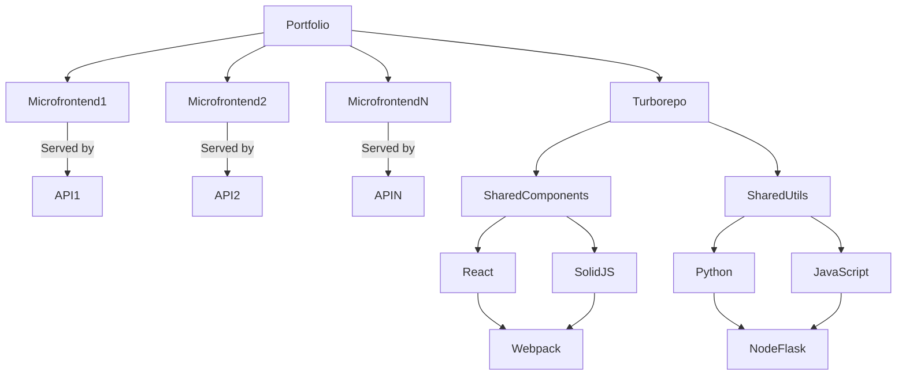

---

# My Portfolio

## Overview

This repository is a monorepo that houses my personal portfolio, built using a microfrontend architecture. Each project within the portfolio is treated as a separate microfrontend, with the portfolio itself acting as the overarching macro application. The goal of this portfolio is to showcase my skills and projects using a variety of modern web technologies.

## Architecture

The architecture of this portfolio is designed to be modular and scalable, with each microfrontend handling a specific project or section of the portfolio. The following technologies and tools are utilized:

- **Turborepo:** Manages the monorepo and optimizes build processes across multiple microfrontends.
- **SolidJS:** Used for certain microfrontends to create highly performant and reactive user interfaces.
- **Webpack:** Bundles and optimizes the assets for each microfrontend, ensuring efficient loading and performance.
- **React & Next.js:** Powers the main portfolio application and some microfrontends, providing a robust and dynamic user experience.
- **TypeScript & JavaScript:** TypeScript is used for type safety and maintainability across most of the codebase, while JavaScript is employed where flexibility is needed.
- **Node.js & Flask:** Backend services that support the portfolio's functionality, with Flask handling any API needs and Node.js managing server-side rendering or other backend tasks.

### Architecture Diagram

Below is a diagram of the microfrontend architecture, illustrating how various APIs serve the different frontend components within the monorepo structure:

## Projects

Below are links to the specific projects within this portfolio repository:

- [alan-turing](https://github.com/brcls/portifolio-monorepo/tree/main/apps/alan-turing)
- [electoral-system-api](https://github.com/brcls/portifolio-monorepo/tree/main/services/electoral-system-api)
- [electoral-system-client](https://github.com/brcls/portifolio-monorepo/tree/main/apps/electoral-system)
- [joystick-api](https://github.com/brcls/portifolio-monorepo/tree/main/services/joystick-api)
- [joystick-client](https://github.com/brcls/portifolio-monorepo/tree/main/apps/joystick)
- [lojinha-simples](https://github.com/brcls/portifolio-monorepo/tree/main/apps/lojinha-simples)
- [portifolio](https://github.com/brcls/portifolio-monorepo/tree/main/apps/main)
- [rgbwallet](https://github.com/brcls/portifolio-monorepo/tree/main/apps/rgbwallet)
- [secret-santa-api](https://github.com/brcls/portifolio-monorepo/tree/main/apps/secret-santa)
- [secret-santa-client](https://github.com/brcls/portifolio-monorepo/tree/main/services/secret-santa-api)
- [video-project-manage](https://github.com/brcls/portifolio-monorepo/tree/main/services/video-project-manage)

Each link will take you directly to the corresponding project folder within the repository.

## License

This project is licensed under the MIT License. See the [LICENSE](LICENSE) file for details.

---
